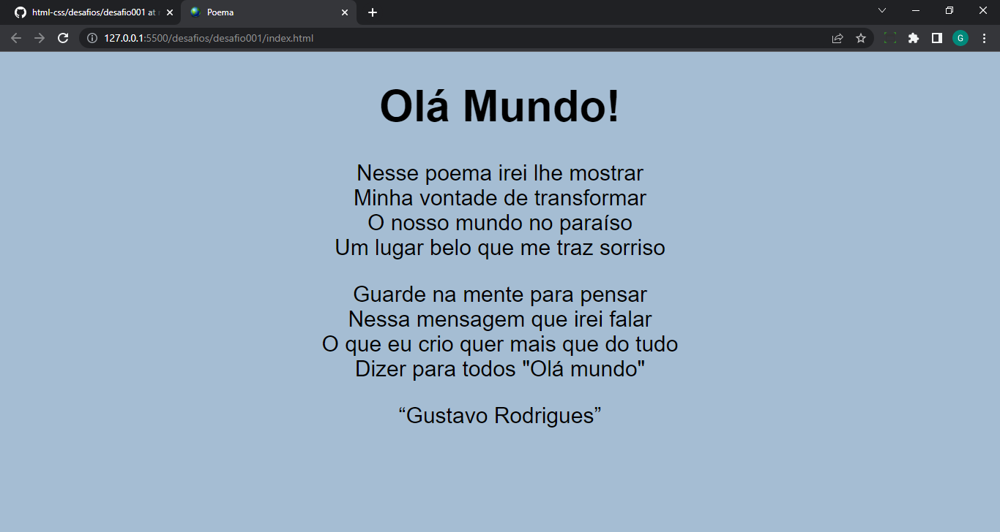
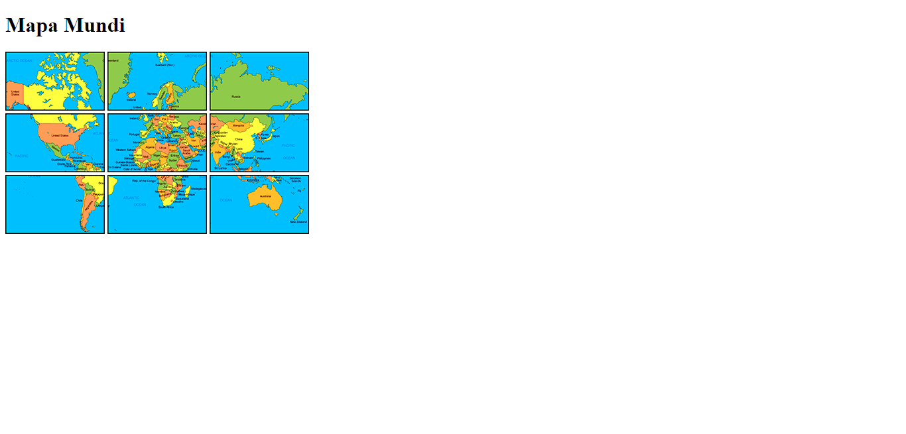
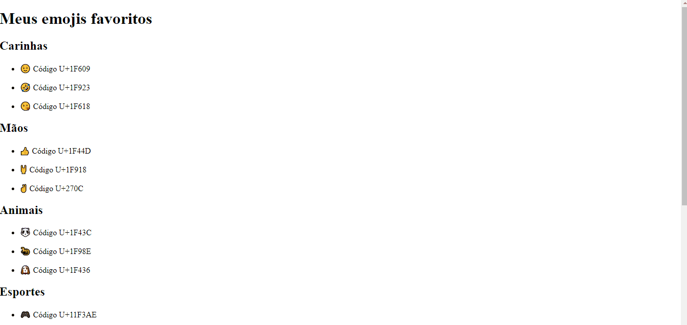
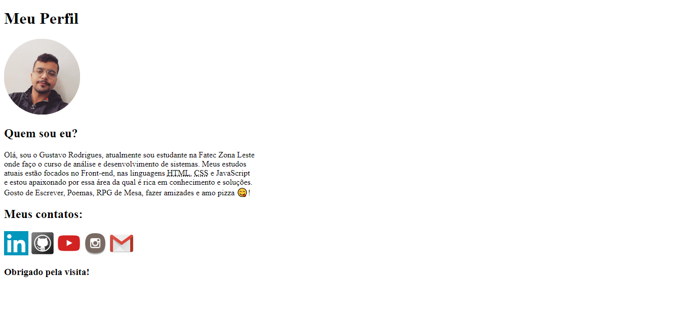
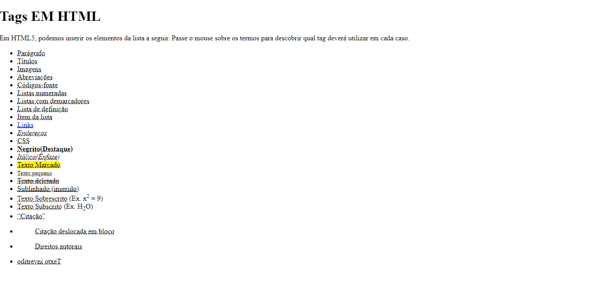
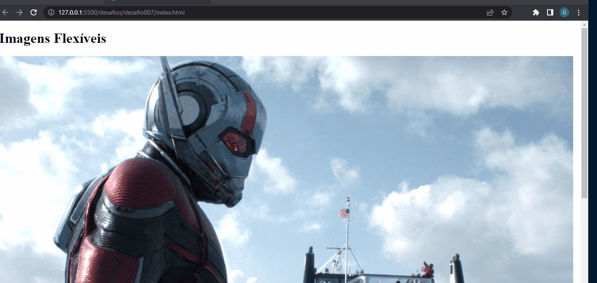
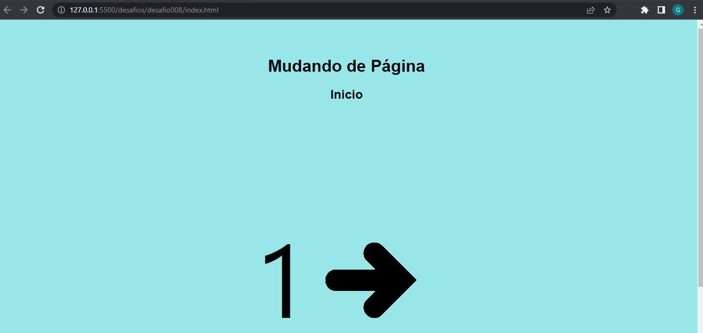
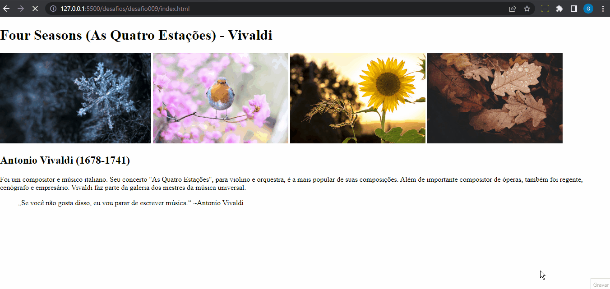

<h1>Desafio 1<h1>

Exibir um texto utilizando parágrafos e quebra de linhas.

<h1>Desafio 2<h1>

Criar um site com imagens e icones no título.Criar um site com imagens e icones no título.

<h1>Desafio 3<h1>

Criar um mapa com as imagens fornecidas para treinar o uso de imagens, quebra de linhas e os parágrafos

<h1>Desafio 4<h1>

Criar um site com seus emojis favoritos e mostrar seus respectivos Unicodes.

<h1>Desafio 5<h1>

Criar uma página que divulgue suas redes sociais, ter uma foto, uma breve descrição e links de acesso as suas redes sociais utilizando HTML.

<h1>Desafio 6<h1>

Criar um site mostrando o significado das pricipais TAGS em HTML.

<h1>Desafio 7<h1>

Colocar uma imagem que se ajuste ao tamanho da tela.

<h1>Desafio 8<h1>

Criar uma página que tenha link com outras páginas.

<h1>Desafio 9<h1>

Criar um site com links para outras páginas das quais tem videos de links externos do youtube.

<h1>Desafio 10<h1>

Criar um Site com os conceitos aprendidos até o momento

